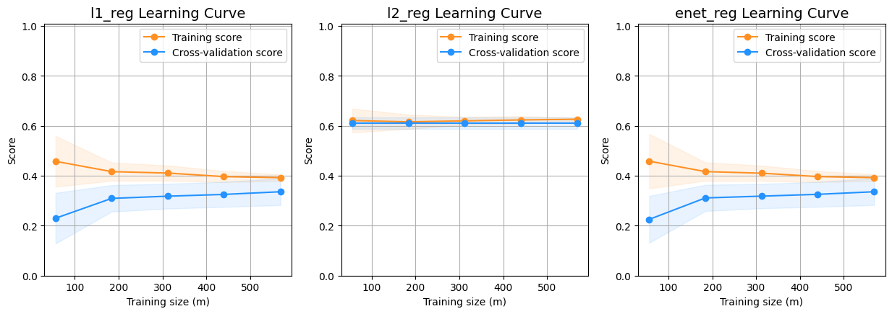
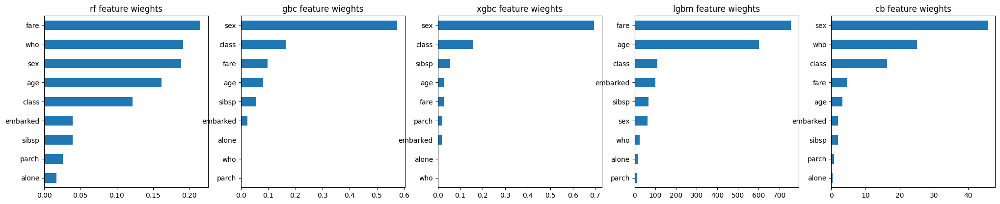

<div style="position: absolute; top: 0; right: 0;">
    <a href="ertugrulbusiness@gmail.com"></a>
    <a href="https://tr.linkedin.com/in/ertu%C4%9Fruldemir?original_referer=https%3A%2F%2Fwww.google.com%2F"></a>
    <a href="https://github.com/ertugruldmr"></a>
    <a href="https://www.kaggle.com/erturuldemir"></a>
    <a href="https://huggingface.co/ErtugrulDemir"></a>
    <a href="https://stackoverflow.com/users/21569249/ertu%c4%9frul-demir?tab=profile"></a>
    <a href="https://medium.com/@ertugrulbusiness"></a>
    <a href="https://www.youtube.com/channel/UCB0_UTu-zbIsoRBHgpsrlsA"></a>
</div>

# Titanic Survive Situation of Passengers Classification

## __Table Of Content__
- (A) [__Brief__](#brief)
  - [__Project__](#project)
  - [__Data__](#data)
  - [__Demo__](#demo) -> [Live Demo](https://ertugruldemir-titanicsurvivesituationclassification.hf.space)
  - [__Study__](#problemgoal-and-solving-approach)
  - [__Results__](#results)
- (B) [__Detailed__](#Details)
  - [__Abstract__](#abstract)
  - [__Explanation of the study__](#explanation-of-the-study)
    - [__(A) Dependencies__](#a-dependencies)
    - [__(B) Dataset__](#b-dataset)
    - [__(C) Pre-processing__](#c-pre-processing)
    - [__(D) Exploratory Data Analysis__](#d-exploratory-data-analysis)
    - [__(E) Modelling__](#e-modelling)
    - [__(F) Saving the project__](#f-saving-the-project)
    - [__(G) Deployment as web demo app__](#g-deployment-as-web-demo-app)
  - [__Licance__](#license)
  - [__Connection Links__](#connection-links)

## __Brief__ 

### __Project__ 
- This is a __classification__ project that uses the well-known __titanic dataset__ to __classify the passengers__ into survived or not based on features.
- The __goal__ is to build a model that accurately __predicts the survive status of the passengers__  based on these features. 
- The performance of the model is evaluated using several __metrics__, including _accuracy_, _precision_, _recall_, and _F1 score_.
#### __Overview__
- This project involves building a machine learning model to classify passengers based on their features. The dataset contains 891 instances. The target distributions is %62 not survived and %38 survived. The project uses Python and several popular libraries such as Pandas, NumPy, and Scikit-learn.

#### __Demo__

<div align="left">
  <table>
    <tr>
    <td>
        <a target="_blank" href="https://ertugruldemir-titanicsurvivesituationclassification.hf.space">[Demo app] HF Space</a>
      </td>
      <td>
        <a target="_blank" href="classification.ipynb">[Demo app] Run in Colab</a>
      </td>
      <td>
        <a target="_blank" href="classification.ipynb">[Traning pipeline] source on GitHub</a>
      </td>
    <td>
        <a target="_blank" href="classification.ipynb">[Traning pipeline] Run in Colab</a>
      </td>
    </tr>
  </table>
</div>


- Description
    - __classify the passenger survive situation__  based on features.
    - __Usage__: Set the feature values through sliding the radio buttons then use the button to predict.
- Embedded [Demo](https://ertugruldemir-titanicsurvivesituationclassification.hf.space) window from HuggingFace Space
    

<iframe
	src="https://ertugruldemir-titanicsurvivesituationclassification.hf.space"
	frameborder="0"
	width="850"
	height="450"
></iframe>

#### __Data__
- The [Titanic dataset](https://www.kaggle.com/c/titanic) is included in the seaborn library and can be loaded directly as a Pandas DataFrame. 
- The dataset contains 15 features and a target variable with binary classes.
- The dataset contains the following features:
<table>
<tr><th>Data Info </th><th><div style="padding-left: 50px;">Stats</div></th></tr>
<tr><td>

| Column        | Non-Null Count | Dtype    |
|:--------------|---------------|----------|
| survived      | 891 non-null   | int64    |
| pclass        | 891 non-null   | int64    |
| sex           | 891 non-null   | object   |
| age           | 714 non-null   | float64  |
| sibsp         | 891 non-null   | int64    |
| parch         | 891 non-null   | int64    |
| fare          | 891 non-null   | float64  |
| embarked      | 889 non-null   | object   |
| class         | 891 non-null   | category |
| who           | 891 non-null   | object   |
| adult_male    | 891 non-null   | bool     |
| deck          | 203 non-null   | category |
| embark_town   | 889 non-null   | object   |
| alive         | 891 non-null   | object   |
| alone         | 891 non-null   | bool     |


</td><td>

<div style="flex: 50%; padding-left: 50px;">

|        | count |    mean   |    std    |  min   | 25%   | 50%    | 75%    |   max    |
|:------:|:-----:|:---------:|:---------:|:------:|:-----:|:------:|:------:|:-------:|
|survived|  891  |  0.383838 | 0.486592  |  0.00  | 0.000 | 0.0000 | 1.0000 |  1.0000  |
| pclass |  891  |  2.308642 | 0.836071  |  1.00  | 2.000 | 3.0000 | 3.0000 |  3.0000  |
|   age  |  714  | 29.699118 | 14.526497 |  0.42  |20.125 | 28.000 | 38.000 | 80.0000  |
| sibsp  |  891  |  0.523008 | 1.102743  |  0.00  | 0.000 | 0.0000 | 1.0000 |  8.0000  |
| parch  |  891  |  0.381594 | 0.806057  |  0.00  | 0.000 | 0.0000 | 0.0000 |  6.0000  |
|  fare  |  891  | 32.204208 | 49.693429 |  0.00  |7.9104 |14.4542 | 31.000 |512.3292 |

</div>

</td></tr> </table>

<div style="text-align: center;">
    
</div>

#### Problem, Goal and Solving approach
- This is a __classification__ project that uses the well-known __titanic dataset__ to __classify the passengers__ into survived or not based on features.
- The __goal__ is to build a model that accurately __predicts the survive status of the passengers__ based on the features.
- __Solving approach__ is that using the supervised machine learning models (linear, non-linear, ensemly) on the dataset through convenient processes.

#### Study
The project aimed classifying the passengers using the features. The study includes following chapters.
- __(A) Dependencies__: Installations and imports of the libraries.
- __(B) Dataset__: Downloading and loading the dataset
- __(C) Pre-processing__: It includes data type casting, feature engineering, missing value hadnling, outlier handling.
- __(D) Exploratory Data Analysis__: Univariate, Bivariate, Multivariate anaylsises. Correlation and other relations.
- __(E) Modelling__: Model tuning via GridSearch on Linear, Non-linear, Ensemble Models. 
- __(F) Saving the project__: Saving the project and demo studies.
- __(G) Deployment as web demo app__: Creating Gradio Web app to Demostrate the project.Then Serving the demo via huggingface as live.

#### results
- The final model is __logistic regression__ because of the results and less complexity.
    -  So we can classify the species with %97 accuracy, precision, recall, f1_score.
<div style="flex: 50%; padding-left: 80px;">

|   | accuracy | precision | recall | f1_score |
|---|---------|-----------|--------|----------|
| loj_reg | 0.966667 | 0.966667 | 0.966667 | 0.966667 |
</div> 

- Model tuning results are below.

<table>
<tr><th>Linear Model Tuning Results</th></tr>
<tc><td>

|            | MaxError | MeanAbsoluteError | MeanAbsolutePercentageError | MSE      | RMSE     | MAE      | R2        | ExplainedVariance |
|------------|----------|-------------------|------------------------------|----------|----------|----------|-----------|-------------------|
| lin_reg    | 0.271042 | 0.178771          | 0.178771                     | 1.0      | 0.0      | inf      | 0.262806  | 0.422813          |
| l1_reg     | 1.0      | 0.0               | inf                          | 0.173184 | 0.416154 | 0.173184 | 0.285843  | 0.296268          |
| l2_reg     | 1.0      | 0.0               | 100.0                        | 0.413408 | 0.642968 | 0.413408 | -0.704762 | 0.0               |
| enet_reg   | 1.0      | 0.0               | inf                          | 0.173184 | 0.416154 | 0.173184 | 0.285843  | 0.296268          |


</td><td> </table>


<table>
<tr><th>Non-Linear Model Tuning Results</th><th><div style="padding-left: 175px;">Ensemble Model Tuning Results</div></th></tr>

<tr><td>

|         | accuracy | precision |  recall  | f1_score |
|:-------:|:--------:|:---------:|:--------:|:--------:|
| loj_reg |  0.8268  |   0.8268  |  0.8268  |  0.8268  |
| nb_params |  0.7877  |   0.7877  |  0.7877  |  0.7877  |
|   knn   |  0.8045  |   0.8045  |  0.8045  |  0.8045  |
|   svc   |  0.8324  |   0.8324  |  0.8324  |  0.8324  |
|    dt   |  0.7821  |   0.7821  |  0.7821  |  0.7821  |


</td><td>
<div style="flex: 50%; padding-left: 175px;">


|        | accuracy | precision |  recall  | f1_score |
|:------:|:--------:|:---------:|:--------:|:--------:|
|   rf   | 0.882682 | 0.882682  | 0.882682 | 0.882682 |
|  gbc   | 0.837989 | 0.837989  | 0.837989 | 0.837989 |
|  xgbc  | 0.854749 | 0.854749  | 0.854749 | 0.854749 |
|  lgbm  | 0.871508 | 0.871508  | 0.871508 | 0.871508 |
|   cb   | 0.843575 | 0.843575  | 0.843575 | 0.843575 |


</div>

</td></tr> </table>


## Details (don't forget using the metrics but DETAILED)
### Table Of content
### Introduction
#### Abstract
- Titanic Dataset is used to classifying the survive situation of passengers. The dataset has 891 records and two class (survived, not survived). The problem is supervised learning task as binary classification. The goal is the predicting the survive situations of the passengers correctly through using supervised machine learning algorithms such as non-linear, ensemble and smilar classic machine learning model.The study includes creating the environment, getting the data, preprocessing the data, exploring the data, modelling the data, saving the results, deployment as demo app. Training phase of the models implemented through cross validation and Grid Search model tuning approachs. Hyperparameter tuning implemented Greedy Greed Search approach which tunes a hyper param at once a time while iterating the sorted order according the importance of the hyperparams. Models are evaluated with cross validation methods using 5 split. Classification results collected and compared between the models. Selected the basic and more accurated model which is the __logistic regression__. Tuned __Logistic regression__ model has __%97__ accuracy, precision, recall, f1_score, the other metrics are also found the results section such as feature importance. End of the study created a demo and served on huggingface space.  
#### File Structures

- File Structure Tree
```bash
  ├── demo_app
  │   ├── app.py
  │   ├── cat_encods.json
  │   ├── component_configs.json
  │   ├── loj_reg.sav
  │   └── requirements.txt
  ├── docs
  │   └── images
  ├── env
  │   ├── env_installation.md
  │   └── requirements.txt
  ├── LICENSE
  ├── readme.md
  └── study.ipynb
```
- Description of the files
  - demo_app/
    - Includes the demo web app files, it has the all the requirements in the folder so it can serve on anywhere.
  - demo_app/cat_encods.json:
    - Encoding the features for prepration of the data into model.
  - demo_app/component_configs.json :
    - It includes the web components to generate web page.
  - demo_app/decision_tree_model.sav:
    - The trained (Model Tuned) model as Decision Tree model instance from sklearn library.
  - docs/
    - Includes the documents about results and presentations
  - env/
    - It includes the training environmet related files. these are required when you run the study.ipynb file.
  - LICENSE.txt
    - It is the pure apache 2.0 licence. It isn't edited.
  - readme.md
    - It includes all the explanations about the project
  - study.ipynb
    - It is all the studies about solving the problem which reason of the dataset existance.    


#### Explanation of the Study
- __(A) Dependencies__:
  -  There in no additional or third-parth installation. The libraries which already installed on the environment are enough. You can create an environment via env/requirements.txt. Create a virtual environment then use hte following code. It is enough to satisfy the requirements for runing the study.ipynb which training pipeline.
- __(B) Dataset__: 
  - Downloading the iris dataset via seaborn library as pandas DataFrame object. The dataset has 891 records.The target has Binary classes as syurvived or not.  There are 15 features, 9 features are categorical and 6 features are numerical.The target variable has two class as supervised and not supervised. for more info such as histograms and etc... you can look the '(D) Exploratory Data Analysis' chapter.
- __(C) Pre-processing__: 
  - The processes are below:
    - Preparing the dtypes such as casting the object type to categorical type.
    - Feature engineering provess for creating new variables and logaritmic transformation.
    - The missing value process are below
      - Removed the 'deck' variable because of the %77 missing value ratio.
      - Imputated the other variables with mean or mode. For futher work the predictive imputations are also added but not used.
    - Outlier analysis using the both visual and OQR calculation apporachs. According to IQR approach detected statistically significant outliers on two variables. These variables are 'age', 'sibsp' and handled using boundary value casting assignment method.  

      <div style="text-align: center;">
          
      </div>
 
- __(D) Exploratory Data Analysis__:
  - Dataset Stats
      <table>
      <tr><th>Data Info </th><th><div style="padding-left: 50px;">Stats</div></th></tr>
      <tr><td>

      | Column        | Non-Null Count | Dtype    |
      |:--------------|---------------|----------|
      | survived      | 891 non-null   | int64    |
      | pclass        | 891 non-null   | int64    |
      | sex           | 891 non-null   | object   |
      | age           | 714 non-null   | float64  |
      | sibsp         | 891 non-null   | int64    |
      | parch         | 891 non-null   | int64    |
      | fare          | 891 non-null   | float64  |
      | embarked      | 889 non-null   | object   |
      | class         | 891 non-null   | category |
      | who           | 891 non-null   | object   |
      | adult_male    | 891 non-null   | bool     |
      | deck          | 203 non-null   | category |
      | embark_town   | 889 non-null   | object   |
      | alive         | 891 non-null   | object   |
      | alone         | 891 non-null   | bool     |

      </td><td>

      <div style="flex: 50%; padding-left: 50px;">

      |        | count |    mean   |    std    |  min   | 25%   | 50%    | 75%    |   max    |
      |:------:|:-----:|:---------:|:---------:|:------:|:-----:|:------:|:------:|:-------:|
      |survived|  891  |  0.383838 | 0.486592  |  0.00  | 0.000 | 0.0000 | 1.0000 |  1.0000  |
      | pclass |  891  |  2.308642 | 0.836071  |  1.00  | 2.000 | 3.0000 | 3.0000 |  3.0000  |
      |   age  |  714  | 29.699118 | 14.526497 |  0.42  |20.125 | 28.000 | 38.000 | 80.0000  |
      | sibsp  |  891  |  0.523008 | 1.102743  |  0.00  | 0.000 | 0.0000 | 1.0000 |  8.0000  |
      | parch  |  891  |  0.381594 | 0.806057  |  0.00  | 0.000 | 0.0000 | 0.0000 |  6.0000  |
      |  fare  |  891  | 32.204208 | 49.693429 |  0.00  |7.9104 |14.4542 | 31.000 |512.3292 |
      </div>

      </td></tr> </table>
  - Variable Analysis
    - Univariate analysis, 
      <div style="text-align: center;">
          
          
          
          
      </div>
    - Bivariate analysis
      <div style="text-align: center;">
          
          
          
          
      </div>
    - Multivariate analysis.
      <div style="text-align: center;">
          
          
      </div>
  - Other relations.
    <div style="display:flex; justify-content: center; align-items:center;">
      <div style="text-align: center;">
      <figure>
      <p>Correlation</p>
      
      </figure>
      </div>
      <div style="text-align: center;">
      <figure>
      <p>Variance</p>
      
      </figure>
      </div>
      <div style="text-align: center;">
      <figure>
      <p>Covariance</p>
      
      </figure>
      </div>
    </div>

- __(E) Modelling__: 
  - Data Split
    - Splitting the dataset via  sklearn.model_selection.train_test_split (test_size = 0.2).
  - Util Functions
    - Greedy Step Tune
      - It is a custom tuning approach created by me. It tunes just a hyperparameter per step using through GridSerchCV. It assumes the params ordered by importance so it reduces the computation and time consumption.  
    - Model Tuner
      - It is an abstraction of the whole training process. It aims to reduce the code complexity. It includes the corss validation and GridSerachCV approachs to implement training process.
    - Learning Curve Plotter
      - Plots the learning curve of the already trained models to provide insight.
  - Linear Models
    - linear, l1, l2, enet regressions
    - Cross Validation Scores
      |            | MaxError | MeanAbsoluteError | MeanAbsolutePercentageError | MSE      | RMSE     | MAE      | R2        | ExplainedVariance |
      |------------|----------|-------------------|------------------------------|----------|----------|----------|-----------|-------------------|
      | lin_reg    | 0.271042 | 0.178771          | 0.178771                     | 1.0      | 0.0      | inf      | 0.262806  | 0.422813          |
      | l1_reg     | 1.0      | 0.0               | inf                          | 0.173184 | 0.416154 | 0.173184 | 0.285843  | 0.296268          |
      | l2_reg     | 1.0      | 0.0               | 100.0                        | 0.413408 | 0.642968 | 0.413408 | -0.704762 | 0.0               |
      | enet_reg   | 1.0      | 0.0               | inf                          | 0.173184 | 0.416154 | 0.173184 | 0.285843  | 0.296268          |
    - Feature Importances
      <div style="display:flex; justify-content: center; align-items:center;">
        <div style="text-align: center;">
          <figure>
          
          </figure>
          </div>
          <div style="text-align: center;">
          <figure>
          
          </figure>
      </div>

    - Learning Curves
      <div style="display:flex; justify-content: center; align-items:center;">
        <div style="text-align: center;">
          <figure>
          
          </figure>
          </div>
          <div style="text-align: center;">
          <figure>
          
          </figure>
      </div>

  - Non-Linear Models
    - Logistic Regression, Naive Bayes, K-Nearest Neighbors, Support Vector Machines, Decision Tree
    - Cross Validation Scores
      |         | accuracy | precision |  recall  | f1_score |
      |:-------:|:--------:|:---------:|:--------:|:--------:|
      | loj_reg |  0.8268  |   0.8268  |  0.8268  |  0.8268  |
      | nb_params |  0.7877  |   0.7877  |  0.7877  |  0.7877  |
      |   knn   |  0.8045  |   0.8045  |  0.8045  |  0.8045  |
      |   svc   |  0.8324  |   0.8324  |  0.8324  |  0.8324  |
      |    dt   |  0.7821  |   0.7821  |  0.7821  |  0.7821  |
    - Feature Importances
      <div style="display:flex; justify-content: center; align-items:center;">
        
      </div>

    - Learning Curves
      <div style="display:flex; justify-content: center; align-items:center;">
          
      </div>


  - Ensemble Models
    - Random Forest, Gradient Boosting Machines, XGBoost, LightGBoost, CatBoost
    - Cross Validation Scores
      |        | accuracy | precision |  recall  | f1_score |
      |:------:|:--------:|:---------:|:--------:|:--------:|
      |   rf   | 0.882682 | 0.882682  | 0.882682 | 0.882682 |
      |  gbc   | 0.837989 | 0.837989  | 0.837989 | 0.837989 |
      |  xgbc  | 0.854749 | 0.854749  | 0.854749 | 0.854749 |
      |  lgbm  | 0.871508 | 0.871508  | 0.871508 | 0.871508 |
      |   cb   | 0.843575 | 0.843575  | 0.843575 | 0.843575 |

    - Feature Importances
      <div style="display:flex; justify-content: center; align-items:center;">
        
      </div>

    - Learning Curves
      <div style="display:flex; justify-content: center; align-items:center;">
          
      </div>


- __(F) Saving the project__: 
  - Saving the project and demo studies.
    - trained model __loj_ref.sav__ as pickle format.
- __(G) Deployment as web demo app__: 
  - Creating Gradio Web app to Demostrate the project.Then Serving the demo via huggingface as live.
  - Desciption
    - Project goal is classify the survive situation of the passengers  based on four features.
    - Usage: Set the feature values through sliding the radio buttons and dropdown menu then use the button to predict.
  - Demo
    - The demo app in the demo_app folder as an individual project. All the requirements and dependencies are in there. You can run it anywhere if you install the requirements.txt.
    - You can find the live demo as huggingface space in this [demo link](https://ertugruldemir-titanicsurvivesituationclassification.hf.space) as full web page or you can also us the [embedded demo widget](#demo)  in this document.  
    
## License
- This project is licensed under the Apache 2.0 License. See the [LICENSE](LICENSE) file for details.

<h1 style="text-align: center;">Connection Links</h1>

<div style="text-align: center;">
    <a href="ertugrulbusiness@gmail.com"></a>
    <a href="https://tr.linkedin.com/in/ertu%C4%9Fruldemir?original_referer=https%3A%2F%2Fwww.google.com%2F"></a>
    <a href="https://github.com/ertugruldmr"></a>
    <a href="https://www.kaggle.com/erturuldemir"></a>
    <a href="https://huggingface.co/ErtugrulDemir"></a>
    <a href="https://stackoverflow.com/users/21569249/ertu%c4%9frul-demir?tab=profile"></a>
    <a href="https://www.hackerrank.com/ertugrulbusiness"></a>
    <a href="https://app.patika.dev/ertugruldmr"></a>
    <a href="https://medium.com/@ertugrulbusiness"></a>
    <a href="https://www.youtube.com/channel/UCB0_UTu-zbIsoRBHgpsrlsA"></a>
</div>

